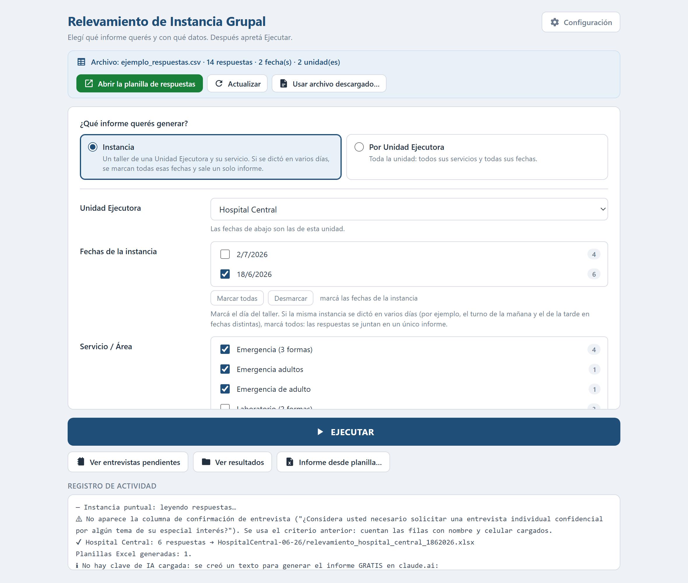

# Automatización de Generación de Informes

Automatización del ciclo completo de un relevamiento de clima laboral: toma las
respuestas de un formulario, arma la planilla de resultados y redacta el informe
técnico en Word, listo para firmar.

Está pensada para un equipo que hace este trabajo a mano —leer las respuestas,
contar porcentajes, escribir el informe— y que **no es técnico**: se abre con
doble clic, se configura una sola vez y se entrega como un `.exe` que no
necesita tener Python instalado.

> **Sobre los datos de este repositorio.** El proyecto se desarrolló para una
> organización real. Todo lo que identificaba a esa organización, sus
> credenciales y sus documentos internos fue reemplazado por material ficticio.
> Ver [Datos y privacidad](#datos-y-privacidad).



<sup>La ventana con el CSV de ejemplo cargado, después de generar la planilla.
Las listas de unidades, fechas y servicios se arman solas con lo que hay
cargado; el registro de abajo va contando lo que pasa mientras trabaja.</sup>

---

## Las tres etapas

```
Google Sheets  ──▶  procesar.py       ──▶  .xlsx + .json
(o un CSV)          filtra, cuenta,         planilla de resultados
                    calcula porcentajes     + resumen para la IA
                                                   │
                                                   ▼
                                            generar_informe.py
                                            prompt con ejemplos de estilo
                                                   │
                                                   ▼
                                            informe .docx sobre
                                            hoja membretada
```

1. **Leer.** Se conecta a la planilla de respuestas del formulario con una
   cuenta de servicio de Google, o lee un CSV exportado si no hay conexión.
2. **Procesar.** Filtra por unidad, fecha y servicio; cuenta las respuestas por
   pregunta y sección; detecta quién pidió una entrevista individual; y genera
   el `.xlsx` con el formato que el equipo ya venía usando.
3. **Redactar.** Arma un prompt con la guía de estilo y los informes previos
   como ejemplo, lo manda a la API de Claude y convierte la respuesta a Word
   sobre la hoja membretada institucional.

Las tres se pueden usar por separado desde la consola, o encadenadas desde la
ventana con un botón.

## Qué hay para mirar

Todo lo que hay en [`ejemplos/`](ejemplos/) lo produjo este mismo código
corriendo sobre `desarrollo/ejemplo_respuestas.csv`, en una sola pasada y **sin
editar la salida a mano**:

| | |
|---|---|
| [`ejemplos/informe_generado.md`](ejemplos/informe_generado.md) | **El informe que escribió el modelo**, tal cual salió. Se lee acá mismo, sin descargar nada |
| [`ejemplos/informe_generado.docx`](ejemplos/informe_generado.docx) | El mismo informe convertido a Word sobre la hoja membretada: el entregable final |
| [`ejemplos/relevamiento_hospital_central.xlsx`](ejemplos/relevamiento_hospital_central.xlsx) | La planilla de resultados que acompaña al informe |
| [`ejemplos/prompt_para_la_ia.txt`](ejemplos/prompt_para_la_ia.txt) | El prompt completo que se le manda al modelo, tal como lo arma el programa |
| [`recursos/estilo_informe.md`](recursos/estilo_informe.md) | La guía de estilo destilada del corpus: estructura, fórmulas, tono y prohibiciones |
| [`recursos/informes_ejemplo/`](recursos/informes_ejemplo/) | El corpus few-shot (ficticio) en los tres formatos que el programa sabe leer |
| [`GUIA.md`](GUIA.md) | La documentación técnica completa: cómo funciona por dentro y **por qué se tomó cada decisión** |

## Cómo se opera

En el uso diario no se toca la consola: se abre con `Iniciar.bat`, se elige la
unidad, la fecha y el servicio en la ventana, y se aprieta Ejecutar. Los
resultados aparecen en una carpeta del Escritorio.

Las tres etapas también corren por separado desde la consola, que es como se
produjeron los archivos de [`ejemplos/`](ejemplos/):

```
procesar.py --csv <archivo> --tipo instancia --unidad <U.E.> --fecha <d/m/aaaa>
     → la planilla .xlsx y el .json de resumen

generar_informe.py <resumen.json>
     → el informe .docx sobre la hoja membretada

generar_informe.py <resumen.json> --sin-clave
     → el prompt en un .txt, sin llamar a la API
```

Ese último modo existe porque permite evaluar la calidad del resultado antes de
decidir pagar la API. Y el camino por CSV existe como plan B: el programa
funciona entero sin conexión a Google y sin clave, que es lo que permitió
generar todo lo que hay en `ejemplos/`.

> Este repositorio se publica **para ser leído, no ejecutado**: ver
> [Licencia](#licencia).

## Configuración

Dos archivos que **nunca se versionan**, con sus plantillas al lado:

- `credenciales.json` — la cuenta de servicio de Google con acceso de lectura a
  la planilla. Forma esperada en [`credenciales.ejemplo.json`](credenciales.ejemplo.json).
- `ajustes.json` — el ID de la planilla y la clave de la API. Lo crea sola la
  ventana de Configuración la primera vez. Forma en
  [`ajustes.ejemplo.json`](ajustes.ejemplo.json).

## Stack y decisiones

- **Python** con `gspread` (Sheets), `openpyxl` (Excel) y `python-docx` (Word).
- **`pywebview`** para la interfaz: una ventana nativa con HTML/CSS/JS adentro.
  Se evaluó una web app con FastAPI y se descartó —un solo usuario, local, no
  técnico— porque agregaba puerto, proceso huérfano al cerrar la pestaña y
  confusión entre descargas y carpeta de resultados. El razonamiento completo
  está en [GUIA.md](GUIA.md#7-decisiones-tomadas-con-el-usuario).
- **API de Claude** con el prompt partido en una parte estable (guía de estilo +
  informes de ejemplo, que se cachean) y una variable (los datos de la
  instancia). El corte está donde está porque el caché es por prefijo: un byte
  que cambie antes del corte invalida todo lo que sigue.
- **`.odt` sin dependencias**: los informes de ejemplo llegan en formato
  LibreOffice, y se leen con `zipfile` + `xml.etree` de la biblioteca estándar,
  descartando las notas al pie —que en OpenDocument van inline y terminaban
  metidas en medio de la frase.
- **PyInstaller** en modo carpeta y no archivo único: el modo de un solo `.exe`
  se descomprime entero en cada arranque y tardaba ~3 segundos en mostrar la
  ventana, sin ninguna señal de que estaba cargando.

## Datos y privacidad

Este repositorio es una versión publicable de un proyecto desarrollado para una
organización real. Para poder publicarlo:

- **No se versiona ninguna credencial.** Ni la clave de la API ni la cuenta de
  servicio de Google ni el ID de la planilla. Están en `.gitignore` desde el
  primer commit y en el repositorio sólo hay archivos `.ejemplo.json` con la
  forma esperada y los valores en blanco.
- **El corpus de informes de ejemplo es ficticio.** Los informes originales eran
  documentos internos sobre situaciones laborales en servicios concretos. Se
  reemplazaron por cuatro informes inventados que reproducen la estructura y la
  extensión, generados por
  [`desarrollo/crear_ejemplos.py`](desarrollo/crear_ejemplos.py). Ninguna
  unidad, fecha, cifra ni testimonio corresponde a algo real.
- **La hoja membretada es ficticia.** La papelería institucional se reemplazó
  por una plantilla equivalente generada por
  [`desarrollo/crear_plantilla.py`](desarrollo/crear_plantilla.py).
- **Los datos de prueba son inventados.** `desarrollo/ejemplo_respuestas.csv`
  tiene unidades, nombres y teléfonos que no existen.
- **La organización no se nombra.** El texto habla de un "Servicio de Salud" y
  de una "Unidad de Mediación y Convivencia" genéricos.

Nada de esto recorta lo que el programa hace: el repositorio funciona de punta a
punta, y los archivos de `ejemplos/` los generó este mismo código sobre los
datos de prueba ficticios.

## Licencia

**Todos los derechos reservados.** Este repositorio es un portfolio: se publica
para que el trabajo pueda verse y evaluarse, no para ser usado, copiado ni
modificado. No es software libre ni de código abierto.

El detalle está en [LICENSE](LICENSE). En resumen: se puede leer y citar con
atribución; cualquier otro uso —ejecutarlo, reproducirlo, derivar de él o
incorporarlo a otro proyecto— necesita autorización por escrito.
